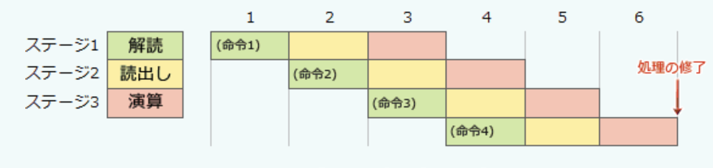
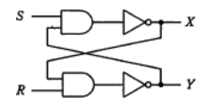

### 平成21年秋期

---
1.2進数の表現で、2の補数を使用する理由

- A.**減算を、負数の作成と加算処理で行うことができる**\
減算する値を2の補数表現にして加算することで求めることができる

- 値が1のビットを数えることでビット誤りを検出できる\
パリティビットの説明

- 除算を、減算の組合せで行うことができる\
除算は減算の組み合わせで行うが2の補数表現は使わない

- ビットの反転だけで、負数を求めることができる\
1の補数表現の説明。2の補数表現ではビット反転の後に1を加える

---
2.誤り検出方式であるCRC(*Cyclic Redundancy Check* : 巡回冗長検査)に関する記述

- A.**送信側では、生成多項式を用いて検査対象のデータから検査用データを作り、これを検査対象のデータに付けて送信する**\
ネットワーク伝送やストレージなどで用いられる。生成多項式で検査用データの生成・認証を行い、単純なパリティチェックでは検出できない偶数個の誤りやバースト(連続した)誤りを検出できる\
1.送信側 : 検査対象のデータをビット列で割り、余りを検査用データとする(136を10で割ったあまりは6)\
$10001000 mod 1010 = 110$\
・10001000(検査対象), 1010(ビット列), 110(検査用データ)\
2.送信側は、検査対象データに検査用データを付加して送信する\
3.受信側は、検査対象データ-検査用データを、送信側と同じ生成多項式で割る(130を10で割った余りは0)\
$(10001000-110) mod 1010 = 0$\
4.余りが0なので誤りなしと判断する

- 検査用データは、検査対象のデータを生成多項式で処理して得られる1ビットの値である\
検査用データのビット数は、生成多項式の次数-1と同じになる

- 受信側では、付加されてきた検査用データで検査対象のデータを割り、余りがなければ送信が正しかったと判断する\
検査対象データに検査用データを連結した値を、送信側と同じ生成多項式で除算し、余りが0になるかどうかで正しさを判断する

- 送信側と受信側では、異なる生成多項式が用いられる\
CRCの方式毎に使う多項式は決められている。多項式が異なるとデータの正しさを確認できないため、同じ生成多項式を利用する

---
4.パイプラインの深さをD、パイプラインのピッチをP秒とすると、I個の命令をパイプラインで実行するのに要する時間を表す式はどれか。パイプラインの各ステージは1ピッチで処理されるものとし、パイプラインハザードは考慮しない

- A.**(1+D-1)P**\
パイプライン制御は、CPU処理を高速化させるため、1命令を命令読出し(フェッチ)、解読(でコード)、アドレス計算、オペランド呼出し、実行などの複数のステージに分け、各ステージを少しずつずらしながら独立した処理機構で並列に実行することで、処理時間全体を短縮させる技法。Dは命令を分割するステージ数を意味する。図の場合はパイプラインピッチを10msとすると、 I=4, D=3のため、処理終了までの時間は60ms

---
5.フェールセーフの考え方

- システムに障害が発生した時でも、常に安全側にシステムを制御する\
システムの不具合や故障が発生した時でも、障害の影響範囲を最小限に留め、常に安全を最優先にして制御を行う考え方。故障時にも安全性を確保し、故障の影響を最小限に抑え、誤作動時に安全に停止したり危険な状態を避けるようにする

- システムの機能に異常が発生した時に、すぐにシステムを停止しないで機能を縮退させて運用を継続する\
障害発生時に縮退運転を行うフェールソフトの考え方。故障や異常の影響を最小限に抑える設計手法。不具合時に全体の機能が失われずに正常な動作が維持される

- システムを構成する要素のうち、信頼性に大きく影響するものを複数備え、システムの信頼性を高める\
冗長構成によって耐障害性を高めるフォールトトレランスの考え方。1部分が故障しても全体が機能し続ける

- 不特定多数の人が操作しても、誤作動が起こりにくいように設計する\
フールプルーフの考え方。誤作動や誤使用をしても事故や損害が発生しにくいような設計

---
6.2台のプリンタがあり、それぞれ稼働率が0.7と0.6である。いずれか一方が稼働していて、他方が故障している確率はいくらか。2台のプリンタの稼働状態は独立で、プリンタ以外の要因は考慮しない

- A.**0.46**\
全体から両方の機器が稼働(故障)している状態の割合を引くことで求められる\
両方が稼働している : $0.7*0.6=0.42$\
両方が故障している : $(1-0.7)(1-0.6)=0.12$\
片方だけが稼働している : $1-(0.42+0.12)=0.46$

---
7.OSI(*Open Source Initiative*)が定義しているOSSの特徴

- A.**営利目的の企業での使用は、研究分野での使用も許可される**\
特定の分野でプログラムを使うことを制限してはならない。営利目的の企業での使用や研究分野での使用も許可される\
オープンソースとして頒布されるプログラムの条件として、再頒布の自由・ソースコードの頒布・派生ソフトウェアの作成頒布の許可・作者のソースコードの完全性・個人やグループ、利用分野に対しての差別の禁止・ライセンスの分配・特定製品でのみ有効なライセンスや、他のソフトウェアを制限するライセンスの禁止、技術的中立を規定している

- OSSとともに頒布される、他のソフトウェアのソースコードも公開しなければならない\
オープンソースであるプログラムを頒布する際には、プログラムとの同時頒布やインターネット上での公開などにより、ソースコードを容易に入手雨可能であることを保証しなければならない。OSSとともに頒布される他のソフトウェアについてはソースコードの公開は必要ない

- OSSを再頒布する場合は、無料にしなくてはならない\
再頒布することについて制限してはならないと規定されている。プログラムを有償で販売することも許可されている

- ソースコードを改変した場合の再頒布条件に、制約があってはならない\
プログラム変更のため、ソースコードと一緒にパッチファイルを頒布することを認める場合に限り、変更されたソースコードの頒布を制限することができると規定されている。改変されていない状態で再頒布する制約をライセンスに含めることもできる

---
8.図の論理回路で、S=1, R=1, X=0, Y=1の時、Sを一旦0にした後、再び1に戻した。この操作を行った後のX, Yの値

- A.**X=1, Y=0**\
フリップフロップ回路と呼ばれ、2つの回路の安定した状態によって1ビットの情報を保持する回路。現在と異なる入力が与えられると、次の入力があるまでその状態を保持しようとする\
初期状態S=1, R=1の時はX=0, Y=1\
S=0に変えると、NOTの出力が1になり、AND(R側)の出力が1になり、NOT(R側)の出力が0になる(=S側ANDの入力)\
この状態でSを1に戻すとX=1, Y=0

---
9.Webアクセシビリティに配慮した画面設計

- A.**仮名入力欄の前には、"フリガナ(カタカナで入力)"のように、仮名の種類も明記する**\
Webページを利用する際に、年齢や身体的制約・利用環境などに関わらず、全ての人が情報や機能にアクセスできるよう設計すること\
利用者が意味を明確に分かるように、利用者が入力する箇所の前には、目的や方式を示すラベル・説明を付ける必要がある。ラベルがあればスクリーンリーダ(画面読み上げ)でも意図が伝わる

- *head*要素の中の*title*要素を同一にして、各ページに同じ表題を付ける\
タイトルが同じ場合、スクリーンリーダ利用時にはページの確認が遅くなるため各ページに内容が端的に分かる固有のタイトルが必要

- 確認は緑、取り消しは赤などのように、共通に使用されるボタンには色だけで判別できるようにする\
色覚異常の人への配慮やモノクロ表示で意味が消えてしまうため、Webアクセシビリティ上、色のみに依存した表示は禁止されている

- ハイパーリング及びボタンは、操作性を良くするために隣り合うものとの関係を狭くとる\
アクションの目標となる要素は操作ミスを防ぐため十分なサイズ・間隔が必要とされている(マウス操作に不慣れな人もいる)
