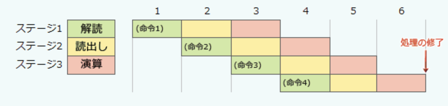
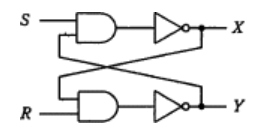
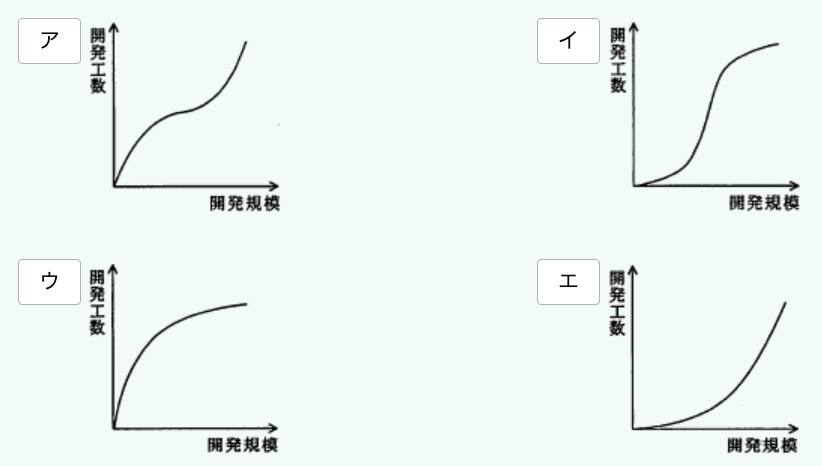

### 平成21年秋期

---
1.2進数の表現で、2の補数を使用する理由

- A.**減算を、負数の作成と加算処理で行うことができる**\
減算する値を2の補数表現にして加算することで求めることができる

- 値が1のビットを数えることでビット誤りを検出できる\
パリティビットの説明

- 除算を、減算の組合せで行うことができる\
除算は減算の組み合わせで行うが2の補数表現は使わない

- ビットの反転だけで、負数を求めることができる\
1の補数表現の説明。2の補数表現ではビット反転の後に1を加える

---
2.誤り検出方式であるCRC(*Cyclic Redundancy Check* : 巡回冗長検査)に関する記述

- A.**送信側では、生成多項式を用いて検査対象のデータから検査用データを作り、これを検査対象のデータに付けて送信する**\
ネットワーク伝送やストレージなどで用いられる。生成多項式で検査用データの生成・認証を行い、単純なパリティチェックでは検出できない偶数個の誤りやバースト(連続した)誤りを検出できる\
1.送信側 : 検査対象のデータをビット列で割り、余りを検査用データとする(136を10で割ったあまりは6)\
$10001000 mod 1010 = 110$\
・10001000(検査対象), 1010(ビット列), 110(検査用データ)\
2.送信側は、検査対象データに検査用データを付加して送信する\
3.受信側は、検査対象データ-検査用データを、送信側と同じ生成多項式で割る(130を10で割った余りは0)\
$(10001000-110) mod 1010 = 0$\
4.余りが0なので誤りなしと判断する

- 検査用データは、検査対象のデータを生成多項式で処理して得られる1ビットの値である\
検査用データのビット数は、生成多項式の次数-1と同じになる

- 受信側では、付加されてきた検査用データで検査対象のデータを割り、余りがなければ送信が正しかったと判断する\
検査対象データに検査用データを連結した値を、送信側と同じ生成多項式で除算し、余りが0になるかどうかで正しさを判断する

- 送信側と受信側では、異なる生成多項式が用いられる\
CRCの方式毎に使う多項式は決められている。多項式が異なるとデータの正しさを確認できないため、同じ生成多項式を利用する

---
4.パイプラインの深さをD、パイプラインのピッチをP秒とすると、I個の命令をパイプラインで実行するのに要する時間を表す式はどれか。パイプラインの各ステージは1ピッチで処理されるものとし、パイプラインハザードは考慮しない

- A.**(1+D-1)P**\
パイプライン制御は、CPU処理を高速化させるため、1命令を命令読出し(フェッチ)、解読(でコード)、アドレス計算、オペランド呼出し、実行などの複数のステージに分け、各ステージを少しずつずらしながら独立した処理機構で並列に実行することで、処理時間全体を短縮させる技法。Dは命令を分割するステージ数を意味する。図の場合はパイプラインピッチを10msとすると、 I=4, D=3のため、処理終了までの時間は60ms

---
5.フェールセーフの考え方

- システムに障害が発生した時でも、常に安全側にシステムを制御する\
システムの不具合や故障が発生した時でも、障害の影響範囲を最小限に留め、常に安全を最優先にして制御を行う考え方。故障時にも安全性を確保し、故障の影響を最小限に抑え、誤作動時に安全に停止したり危険な状態を避けるようにする

- システムの機能に異常が発生した時に、すぐにシステムを停止しないで機能を縮退させて運用を継続する\
障害発生時に縮退運転を行うフェールソフトの考え方。故障や異常の影響を最小限に抑える設計手法。不具合時に全体の機能が失われずに正常な動作が維持される

- システムを構成する要素のうち、信頼性に大きく影響するものを複数備え、システムの信頼性を高める\
冗長構成によって耐障害性を高めるフォールトトレランスの考え方。1部分が故障しても全体が機能し続ける

- 不特定多数の人が操作しても、誤作動が起こりにくいように設計する\
フールプルーフの考え方。誤作動や誤使用をしても事故や損害が発生しにくいような設計

---
6.2台のプリンタがあり、それぞれ稼働率が0.7と0.6である。いずれか一方が稼働していて、他方が故障している確率はいくらか。2台のプリンタの稼働状態は独立で、プリンタ以外の要因は考慮しない

- A.**0.46**\
全体から両方の機器が稼働(故障)している状態の割合を引くことで求められる\
両方が稼働している : $0.7*0.6=0.42$\
両方が故障している : $(1-0.7)(1-0.6)=0.12$\
片方だけが稼働している : $1-(0.42+0.12)=0.46$

---
7.OSI(*Open Source Initiative*)が定義しているOSSの特徴

- A.**営利目的の企業での使用は、研究分野での使用も許可される**\
特定の分野でプログラムを使うことを制限してはならない。営利目的の企業での使用や研究分野での使用も許可される\
オープンソースとして頒布されるプログラムの条件として、再頒布の自由・ソースコードの頒布・派生ソフトウェアの作成頒布の許可・作者のソースコードの完全性・個人やグループ、利用分野に対しての差別の禁止・ライセンスの分配・特定製品でのみ有効なライセンスや、他のソフトウェアを制限するライセンスの禁止、技術的中立を規定している

- OSSとともに頒布される、他のソフトウェアのソースコードも公開しなければならない\
オープンソースであるプログラムを頒布する際には、プログラムとの同時頒布やインターネット上での公開などにより、ソースコードを容易に入手雨可能であることを保証しなければならない。OSSとともに頒布される他のソフトウェアについてはソースコードの公開は必要ない

- OSSを再頒布する場合は、無料にしなくてはならない\
再頒布することについて制限してはならないと規定されている。プログラムを有償で販売することも許可されている

- ソースコードを改変した場合の再頒布条件に、制約があってはならない\
プログラム変更のため、ソースコードと一緒にパッチファイルを頒布することを認める場合に限り、変更されたソースコードの頒布を制限することができると規定されている。改変されていない状態で再頒布する制約をライセンスに含めることもできる

---
8.図の論理回路で、S=1, R=1, X=0, Y=1の時、Sを一旦0にした後、再び1に戻した。この操作を行った後のX, Yの値

- A.**X=1, Y=0**\
フリップフロップ回路と呼ばれ、2つの回路の安定した状態によって1ビットの情報を保持する回路。現在と異なる入力が与えられると、次の入力があるまでその状態を保持しようとする\
初期状態S=1, R=1の時はX=0, Y=1\
S=0に変えると、NOTの出力が1になり、AND(R側)の出力が1になり、NOT(R側)の出力が0になる(=S側ANDの入力)\
この状態でSを1に戻すとX=1, Y=0

---
9.Webアクセシビリティに配慮した画面設計

- A.**仮名入力欄の前には、"フリガナ(カタカナで入力)"のように、仮名の種類も明記する**\
Webページを利用する際に、年齢や身体的制約・利用環境などに関わらず、全ての人が情報や機能にアクセスできるよう設計すること\
利用者が意味を明確に分かるように、利用者が入力する箇所の前には、目的や方式を示すラベル・説明を付ける必要がある。ラベルがあればスクリーンリーダ(画面読み上げ)でも意図が伝わる

- *head*要素の中の*title*要素を同一にして、各ページに同じ表題を付ける\
タイトルが同じ場合、スクリーンリーダ利用時にはページの確認が遅くなるため各ページに内容が端的に分かる固有のタイトルが必要

- 確認は緑、取り消しは赤などのように、共通に使用されるボタンには色だけで判別できるようにする\
色覚異常の人への配慮やモノクロ表示で意味が消えてしまうため、Webアクセシビリティ上、色のみに依存した表示は禁止されている

- ハイパーリング及びボタンは、操作性を良くするために隣り合うものとの関係を狭くとる\
アクションの目標となる要素は操作ミスを防ぐため十分なサイズ・間隔が必要とされている(マウス操作に不慣れな人もいる)

---
10.コンピュータグラフィックスの要素技術に関する記述

- A.**アンチエイリアシングは、周囲の画素との平均値演算などを施すことで、斜め線や曲線のギザギザを目立たなくする**\
デジタル画像の物体の輪郭に現れるピクセルのギザギザ(ジャギー)を、滑らかに見せるための周囲(背景)の画素値と平均化処理をして描画するCG技法

- メタボールは、光の相互反射を利用して物体表面の光エネルギーを算出することで、表面の明るさを決定する\
ラジオシティの説明(照明計算の分類)

- ラジオシティは、高原からの光線の経路を計算することで光の反射や透過などを表現し、物体の形状を描画する\
レイトレーシングの説明(ゲームのリアルな映像)

- レイトレーシングは、物体や球や楕円の集合として擬似的にモデル化する\
メタボールの説明

---
14.公開鍵暗号方式を用いて送信者が文書にデジタル署名を行う場合、文書が間違いなく送信者のものであると受信者が確認できるもの

- A.**送信者は自分の秘密鍵を使用して署名処理を行い、受信者は送信者の公開鍵を使用して検証処理を行う**\
1.送信者は、`送信者の秘密鍵`で署名して、署名データを作成し、メッセージに付加して送信する\
2.受信者は、受信したメッセージのハッシュ値と`送信者の公開鍵`を用いて、署名データを検証する\
3.検証は、鍵ペアが正しい場合に限り成功する。通信内容が改ざんされていないことと送信者の正当性が確認できる\
送信者の秘密鍵は署名の生成、送信者の公開鍵は署名の検証に使用される

---
15.JIS Q 2001:2001に規定されたリスク算定の定量的評価を、組織のセキュリティ対策の優先度を検討するリスク分析に適用したもの

- A.**被害が発生する確率と被害額で評価する**\
リスクの大きさを金額(数値)で表す評価手法。被害想定を数値で表しているので定量的評価

- 過去に発生した被害件数と対策の難易度で評価する
- 攻撃に対する対処時間と被害の顕在性で評価する
- 攻撃もとの特定可否と攻撃手法の新しさで評価する\
定性的評価に該当する。ランク付やレベルなどの金額以外で表す手法

---
16.JIS X 0129-1で定義されたソフトウェア製品の品質副特性の説明のうち、信頼性に分類されるもの

- A.**故障時に、指定された達成水準に再確立し、直接に影響を受けたデータを回復するソフトウェア製品の能力**\
回復性に該当するので`信頼性`(*Reliability*)に分類される。機能が正常動作し続ける度合い、障害の起こりにくさの度合い\
全部で6つの特性があり、他の特性は下記の通り\
`効率性`(*Efficiency*) : 目的達成のために使用する時間や資源の度合い\
`移植性`(*Portability*) : 移植のしやすさ、別環境へ移した際そのまま動作する度合い

- ソフトウェアにある欠陥の診断又は故障原因の追及、及びソフトウェアの修正箇所の識別を行うためのソフトウェア製品の能力\
解析性に該当するので`保守性`(*Maintainability*)に分類される。保守(改訂)作業に必要な労力の度合い

- 1つ以上の指定されたシステムと相互作用するソフトウェア製品の能力\
相互運用性に該当するので`機能性`(*Functionally*)に分類される。目的から求められる必要な機能の実装の度合い

- 利用者がソフトウェアの運用及び運用管理を行うことができるソフトウェア製品の能力\
運用性に該当するので`使用性`(*Usability*)に分類される。分かりやすさ、使いやすさの度合い

---
17.取得者(発注者)と供給者(受注者)の二社間取引を明確化するためのものであり、業務分析、業務設計、ソフトウェアを中心としたシステムの企画、要件定義、開発、運用、保守及びそれに関わる諸活動を対象としており、国際規格に適合しているもの

- A.**共通フレーム**\
ソフトウェア産業界においての共通の物差しとなることを目的として作成された規格。取得者と供給者双方、またはシステム開発に関わる全ての人が、ソフトウェアを中心としたシステムの企画、要件定義、開発、運用、保守の作業内容を共通に参照できるように詳細に表現したり、ソフトウェア取引を明確化したりするための基準が記述されている、諸活動を通じて行われる作業を包括的に規定した規格

- CMMI(*Capability Maturity Model Integration*)\
統合能力成熟度モデルと呼ばれ、組織におけるプロセス改善をガイドするモデル

- PMBOK(*Project Management Body of Knowledge*)\
アメリカのプロジェクトマネジメント協会が策定しているプロジェクト管理のフレームワーク

- ソフトウェア保守規格\
存在しない

---
19.ソフトウェアの開発規模と開発工数の関係を示すグラフ

- A.**エ**\
開発規模が増えるほど開発に関わる要員が増え、情報伝達や要員の管理に多くの時間がかかるようになるため、一般的にソフトウェアは開発規模の拡大に伴い、開発工数が指数関数的に増大すると言われている

---
20.システム移行方式のうち、パイロット移行方式について説明したもの

- A.**限定した部門で新システムを導入・観察した後にほかの全部門を移行するので、移行に関する問題が発生しても影響範囲を局所化できる**\
全部門を同時に新システムに切り替えるのではなく、限定的な部門だけに新システムを導入し、その運用状況や移行経験を生かして全体的なシステムの移行につなげていく方式。一斉移行方式と比較しトラブル時の影響を局所化でき、順次移行方式と比較して移行のスケジュールを短くできるメリットがある

- 機能的に閉じたサブシステム単位に、短期間で順次移行していくので、運用部門の負荷が少なく、問題が発生しても当該サブシステム内に抑えることができる\
順次移行方式の説明

- 新・旧両システム分のリソースを用意し、並行稼動させるので、新システムで問題が発生しても業務への影響を最小にできる\
並行運用移行方式の説明

- ほかの移行方式に比べると移行期間は短くできるが、事前に全部門との間で詳細な計画を立てるとともに、新システムに高い信頼性が要求される\
一斉移行方式の説明

---
21.ITILにおいて、問題管理でエラーの根本原因を識別した後にRFCを出す対象となるプロセス

- A.**変更管理**\
問題管理が、インシデントの恒久的な原因を突き止め、問題解決のためのシステムの変更を変更管理に要求することになっている。この時に出される変更要求がRFC(*Request For Change*)

---
22.システム監査人が行った監査業務の実施記録であり、監査意見表明の根拠となるべき監査証拠、その他関連資料などをまとめたもの

- A.**監査調書**\
実施した監査手続の結果の裏付けとなるため、監査の結論に至った経緯が分かるように記述され関連資料をまとめた文書。下記目的がある\
・監査計画、監査手続、レビューを文書化する\
・監査報告書に記載する監査手続などの裏付けとなること\
・次回の監査や別のシステム監査人による監査のための基礎資料となること

- 監査チェックリスト\
監査を効果的に行うために、何をどのように監査するかをまとめたもの

- 監査手続書\
時期や範囲などの監査の詳しい方法を記述した文書

- 監査報告書\
実施した監査の対象、監査の概要、保証意見又は助言意見、制約又は助芸事項、指摘事項、改善勧告などを監査証跡との関係を示しながら記述した文書

---
23.エンタープライズアーキテクチャを構成する4つの体系のうち、ビジネスアーキテクチャを策定する場合の成果物

- A.**業務流れ図**\
ビジネスアーキテクチャ(政策・業務体系)の成果物。政策・業務の内容、実施主体、業務フロー等について、共通化・合理化など実現すべき姿を体系的に示したもの。業務説明書、機能構成図など

- 実体関連ダイアグラム\
データアーキテクチャ(データ体系)の成果物。各業務・システムにおいて利用される情報、システム上のデータの内容、各情報(データ)間の関連性を体系的に示したもの。情報体系クラス図、エンティティ・リレーション図、データ定義表など

- 情報システム関連図\
アプリケーションアーキテクチャ(処理体系)の成果物。業務処理に最適な情報システムの形態を体系的に示したもの。情報システム関連図、情報システム機能構成図など

- ソフトウェア構成図\
テクノロジアーキテクチャ(技術体系)の成果物。実際にシステムの構築する際に利用する諸々の技術的構成要素を体系的に示したもの。ネットワーク構成図、ソフトウェア(ハードウェア)構成図など

---
24.システム管理基準によれば、組織全体の情報システムのあるべき姿を明確にする計画

- A.**全体最適化計画**\
組織体全体の情報システムのあるべき姿を明確にすること、という記述がある

- 開発計画\
全体最適化計画が策定された後、目的・対象業務・費用・スケジュール・開発体制・投資効果等を明確にするなどシステム化の構想・立案を行うプロセス

- 事業継続計画(BCP)\
予期せぬ重大災害が発生した場合、必要最低限の事業を継続しつつ、業務を早期に復旧・再開できるようにするための行動計画

- 年間運用計画\
システムの運用業務の年間計画。月次、日次等の運用計画を策定する

---
25.RFI(*Request for Information* : 情報提供依頼書)を説明したもの

- A.**ユーザ要件を実現するために、現在の状況において利用可能な技術・製品、ベンダにおける導入実績など実現手段に関する情報提供をベンダに依頼する文書**\
企業・組織がシステム調達や業務委託をする場合や、初めての取引となるベンダ企業に対して情報の提供を依頼する、またはその際に提出される文書のこと。RFIによって相手が保有する技術・経験や、情報技術動向、導入予定のシステムが技術的に実現可能かなどを確認できる。要件定義や発注先候補の選定に利用できる。その後、自社の要求を取りまとめたRFPが発注先候補に対して発行される

- サービス提供者と顧客との間で、提供するサービスの内容、品質などに関する保証範囲やペナルティについてあらかじめ契約としてまとめた文書\
SLA(*Service Level Agreement*)の説明

- システムの調達に際して、調達側から技術的要件やサービスレベル要件を提示し、ベンダに対して、指定した期限内で効果的な実現策の提案を依頼する文書\
RFP(*Request for Proposal* : 提案依頼書)の説明

- 要求定義との整合性を図り、ユーザと開発要員及び運用要員の共有物とするために、業務処理の概要、入出力情報の一覧、データフローなどをまとめた文書\
システム仕様書の説明

---
26.デルファイ法の説明

- A.**専門家にアンケートを何度か繰り返し、その結果をフィードバックして意見を収束させる**\
技術革新や社会変動などに関する未来予測においてよく用いられる\
1.複数の専門家を回答者として選定し、個別に質問を行う\
2.質問に対する回答結果をフィードバックし、再度質問を行う\
3.回答結果を統計的に処理し、確率分布とともに回答結果を示す

- 会議の参加者に自由にアイデアを出させ、出されたアイデアに批判や評価を加えないようにする\
ブレーンストーミングの説明

- 将来にわたる意思決定の各段階を樹木構造で示した図に基づいて、最適な意思決定の経路を求める\
デシジョンツリー(決定木)の説明

- 予測項目間の影響度を定量化してマトリックスを示し、予測項目間の波及効果をシミュレーションして定量的に示す\
クロスインパクト分析の説明

---
27.ラディカルイノベーションの説明

- A.**経営構造の全面的な変革を必要とする技術革新である**

- 革新的な新製品を開発するといった、製品そのものに関する技術革新である\
新製品開発による技術革新は、プロダクトイノベーションと言われる

- 既存製品の細かな部品改良を積み重ねる技術革新である\
部分改良を積み重ねる技術革新は、インクリメンタルイノベーションと言われる

- 研究開発工程、製造工程、及び物流過程の技術革新である\
工程や物流の改善による技術革新は、プロセスイノベーションと言われる

---
28.セル生産(一人屋台)方式の利点が生かせる対象

- A>**多種類かつフレキシブルな生産が求められるもの**\
製造業における生産方式の一種で、1人または少数の作業者チームで製品の組み立て工程を完成(または検査)まで行うもの。作業者の周囲に機械・組付工具・部品が配置され、多能工が歩き回って作業する。作業者1人が受け持つ範囲が広く多品種を生産する時フレキシブルな切り替えが可能

- 生産を上げるために、大量生産が必要なもの
- 製品の仕様が長期間変わらないもの\
大量生産で生産性を上げる・仕様が長期間変わらない製品についてはライン生産方式が適している

- 標準化、単純化、専門化による分業が必要なもの\
多工程を1人または少人数で行う。作業工程毎に専門家を必要とする場面には向いていない

---
30.利用権限をもたない第三者が、他人のIDやパスワードを使ってネットワークに接続されたコンピュータを利用可能にする行為及びその助長行為を処罰の対象にしている法律

- A.**不正アクセス禁止法**\
不正アクセスとは、主に3つの行為を指す\
・他人のID/パスワードを使ってアクセス制御機能を持ち本来制限されている機能を利用可能な状態にする行為\
・アクセス制御機能を持つコンピュータにアクセスし不正な手段で本来制限されている機能を利用可能な状態にする行為\
・アクセス制御機能を持つ他のコンピュータによって制限されているコンピュータに不正な手段で本来制限されている機能を利用可能な状態にする行為\
Webサイトで使用している他人のID/パスワードを無断で第三者に教えたり、特定可能であるコンピュータにアクセスするための情報を電子掲示板に書き込んだりする行為も不正アクセスを助長する行為として処罰の対象

- 刑法\
犯罪とそれに対する刑罰の種類を規定する法律

- 通信傍受法\
犯罪の組織化、複雑化、科学科に対応するための操作手段としての通信傍受の要件、手続きについて規定する法律

- 電気通信事業法\
固定電話や携帯電話等の電気通信サービスを提供する事業について定めている法律

---
1.100Mビット/sのLANを使用し、1件のレコード長が1,000バイトの電文を1,000件連続して伝送する時の伝送時間は何秒か。LANの伝送効率は50%とする

- A.**0.16**\
1レコードの長さは1,000バイト=8,000ビット\
伝送するレコードの総量は、8,000,000ビット=8Mビット
伝送効率50%なので50Mビット/sと考えると、\
8Mビット/50Mビット/s=0.16秒

---
2.CSMA/CD方式のブリッジで接続された2つのセグメント間で、ブロードキャストフレームの中継と、衝突発生時にできる不完全フレームの中継についての組み合わせ

- A.**ブロードキャストフレームは中継するが、衝突発生時にできる不完全フレームは中継しない**\
ブリッジは、ブロードキャストフレームを受信すると他の全てのポートからフレームを一斉に送信する。CSMA/CD方式では衝突を検出したホストは送信を中止するため不完全なフレームがネットワークを流れる。不完全フレームはリピータで隔てられた別セグメントへは送られるが、ブリッジを超えて中継はされない

---
3.CSMA方式のLAN制御に関する記述

- A.**キャリア信号を検出し、データの送信を制御する**\
伝送媒体のキャリア信号(伝送波)を監視し、他のノードが通信中かどうかの確認を行うことで信号が衝突しないよう制御する\
CSMA方式は、送信前に1度受信を試み、他のノードが送信中で無いかどうか確認してから送信を開始する搬送波感知(*Carrier Sense*)の仕組みで、複数のノードが単一の伝送媒体を共有して送受信を行うネットワークでの多元接続(*Multiple Access*)を制御する伝送手順\
CSMAが単体で使用されることはなく、イーサネット(有線LAN)におけるCSMA/CD、無線LANにおけるCSMA/CDなどのように他の衝突検知・回避の仕組みと組み合わされて使用される

- 送信権をもつメッセージ(トークン)を得た端末がデータを送信する\
トークンバッシング制御方式の説明(トークンは巡回しない)

- データ送信中に衝突が起こった場合は、直ちに再送を行う\
衝突を検出した場合、一旦フレーム送出を中止し、ランダムな時間待った後に再びキャリア信号の監視を行い、伝送路が空いていればフレームを再送する

- 伝送路が使用中でもデータの送信はできる\
他のノードが通信中であることを検出した時は、フレーム送出を待機する

---
5.ネットワークのQoS(*Quality of Service*)で使用されるトラフィック制御方式に関する説明

- A.**通信を開始する前にネットワークに対して帯域などのリソースを要求し、確保の状況に応じて通信を制御することを、アドミッション制御という**\
新たに通信を開始する場合、システム内の資源の利用状況を考慮して、余裕がある時にのみその要求を受け付けるよう制御する\
ネットワークを利用する上で特定の通信の帯域を確保しサービスの品質を保つ技術。優先度制御や帯域制御によって運ばれるデータ内容に応じて扱いに差をつけることで、通信遅延や停止が許されないサービスの品質を保証する

- 入力されたトラフィックが規定された最大速度を超過しないか監視し、超過分のパケットを破棄するか優先度を下げることを、シェーピングという\
ポリシングの説明

- パケットの送出間隔を調整することによって、規定された最大速度を長会しないようにトラフィックを平準化する制御を、ポリシングという\
シェーピングの説明

- フレームの種類や宛先に応じて優先度を変えて中継することを、ベストエフォートという\
優先制御の説明。ベストエフォートは、通信網は最善を尽くすが利用状況によっては通信の品質を保証しないというサービス方針。品質や信頼性は高く無いが低価格で提供される

---
7.TCP/IPネットワークで使用されるARPの説明

- A.**IPアドレスからMACアドレスを得るためのプロトコル**\
1.ARP要求フレームに送信元IPアドレス・MACアドレスと取得したいノードのIPアドレスを取得して、Ethernetネットワークにブロードキャストする\
2.ARP要求フレームを受け取った各ノードは、フレーム内の解決対象IPアドレスが自身のIPアドレスと一致すれば、ARP応答フレームに自身のMACアドレスを格納して送信元にユニキャストで送信する

- MACアドレスからIPアドレスを得るためのプロトコル\
RARPの説明

- IPアドレスからホスト名(ドメイン名)を得るためのプロトコル\
DNSの逆引きの説明

- ホスト名からIPアドレスを得るためのプロトコル\
DNSの正引きの説明

---
8.DHCPを用いるネットワーク構成で、リレーエージェントが必要になるのは、ネットワークにどの機器が用いられている場合か

- A.**ルータ**\
DHCPでのIPアドレス割り当てでは、クラインと端末のIPアドレスが未定でありブロードキャストパケットを使用して通信を行う。規模の大きなネットワークでは複数のセグメントをルータで接続するが、1ネットワークを1つのDHCPサーバが管理すると、ルータがブロードキャストパケットを中継しないため、DHCPクライアントとDHCPサーバが通信できない問題が生じる\
1.割り当てを要求するDHCPクライアントは、DHCPメッセージをブロードキャストする\
2.リレーエージェントはDHCPメッセージを受信すると、その内容を取り出しユニキャストでDHCPサーバに転送する\
3.DHCPサーバは、受信するとユニキャストでリレーエージェントに送信する\
4.リレーエージェントはDHCPメッセージを受信すると、その内容を取り出しブロードキャストでDHCPクライアントに転送する

---
9.DNSに関する記述

- A.**インターネット上のDNSサーバは階層化されており、ある名前に対して情報がない場合は、上位のDNSサーバに問い合わせる**\
ドメイン名とIPアドレスを結びつけて変換する仕組みで、IPアドレスとドメイン名の対応関係を提供する側をDNSサーバ(ネームサーバ)、クライアントをリゾルバと呼ぶ。DNSサーバは対応関係を階層構造で記憶していて、必要に応じてトップレベルのルートDNSサーバから下位に向かって順に問い合わせを行い、目的の対応を得る。通常2系統以上で構成され、主系をプライマリサーバ、複系をセカンダリサーバと呼ぶ

- セカンダリサーバは、大規模なネットワークシステムにおいてプライマリサーバの負荷を軽減するために用いられ、プライマリサーバとは異なる内容のDBを保持している\
プライマリサーバと定期的に同期を行うことでドメイン情報の複製を保持する

- ネームリゾルバは、クライアントからの要求に対し、DBを使用してドメイン名、ホスト名に対応するIPアドレスを返すプログラムである\
利用者からの名前解決要求に対してネームサーバに問い合わせをし、結果をクライアントに返すソフトウェア

- リソースレコードには、ドメイン、ホスト、ネームサーバなどに関する情報が保持されており、DNSサーバの構築時に登録され、更新できない\
リソースレコードは更新可能

---
10.HTTPのGETメソッドとPOSTメソッドに関する記述

- A.**GETの実装は必須であるが、POSTはオプションである**\
共にサーバにリクエストを行うメソッドだが、フォームデータなどのCGIなどで使用するパラメータをWebサーバへ受け渡す時の方法が異なる\
`GET` : 項目=値の形式でテキストデータを付加して送信する。サーバに遅れるデータはテキスト形式のみで文字数に制限がある。URLの一部としてデータが含まれるため、ユーザIDやセッションIDなどを付加すると機密情報の漏洩の危険がある\
`POST` : パラメータをメッセージボディにセットしサーバに渡す。テキスト以外にもバイナリ形式のデータにも対応しており、掲示板への書込み要求やファイル・画像のアップデートなどのデータ量が多い送信に使用される

- GETはサーバへの送信、POSTはサーバからの応答である\
サーバへのデータの引き渡し方法が異なるが、どちらもHTTPリクエスト(Webページ取得要求)で使用される

- POSTの応答はキャッシュされるが、GETはキャッシュされない\
GETで取得したページはキャッシュされ、POSTで取得したページはキャッシュされない

- POSTはサーバのCGIを起動できるが、GETは起動できない\
どちらのメソッドでもCGIを起動できる

---
11.電源オフ時にIPアドレスを保持できない装置が、電源オン時に自装置のMACアドレスから自装置に割り当てられているIPアドレスを知るために用いるデータリンク層のプロトコルで、ブロードキャストを利用するもの

- A.**RARP**(*Reverse Address Resolution Protocol*)\
ARPがIPアドレスから機器のMACアドレスを得るのとは逆に、機器固有のMACアドレスから対応するIPアドレスを取得するためのプロトコル

- ARP(*Address Resolution Protocol*)\
IPアドレスから対応する機器のMACアドレスを取得するプロトコル

- DHCP(*Dynamic Host Configuration Protocol*)\
TCP/IPネットワークで、ネットワークに接続するノードへのIPアドレスの割り当てをアドレスプールから自動的に行うプロトコル

- DNS(*Domain Name System*)\
TCP/IPを利用したネットワークで、ドメイン名・ホスト名とIPアドレスを結びつけて変換(名前解決)する仕組み

---
12.HTTPを使って、Webサーバのコンテンツのアップロードや更新を可能にするプロトコル

- A.**WebDAV**\
Webサーバとブラウザ間のやり取りを担うHTTPの仕様を拡張し、ファイルのアップロード/ダウンロードに加えて属性の設定などのファイル管理をできるようにしたプロトコル。XML形式のデータがメッセージボディ部に記述されたHTTPリクエスト、レスポンスを受け渡すことで処理の要求、応答が行われる。属性情報の設定・取得の他にも、ファイル作成・移動・コピーなどのコンテンツ編集で使用する機能がHTTP上で実現できるようになっている

- CSS(*Cascading Style Sheets*)\
HTMLの要素をどのようにして修飾して表示させるかを定義する文書で、構造をデザインを別文書に分離させるために提唱されたスタイルシートの仕様

- MIME(*Multipurpose Internet Mail Extensions*)\
ASCII文字しか使用できないSMTPを利用したメールで、日本語の2バイトコードや画像データを送信するための仕組み

- SSL(*Secure Sockets Layer*)\
インターネット上の通信で、盗聴や改ざん、メッセージの偽造を防ぐセキュアプロトコル

---
13.ネットワークに接続されているホストのIPアドレスが212.62.31.90で、サブネットマスクが255.255.255.224の時のホストアドレス

- A.**26**\
サブネットマスクの下位8ビットは224(`0b 1110 0000`)なので、ホストアドレスは下位5ビットがホストアドレス。ホストのIPアドレスの下位8ビットは90(`0b 0101 1010`)なので、下位5ビットを10進数に変換して26

---
14.サブネットマスクが/24である4つのネットワーク 192.168.32.0, 192.168.33.0, 192.168.34.0, 192.168.35.0を、CIDRを使ってスーパーネット化した時のネットワーク番号とサブネットマスクの組み合わせ

- A.**ネットワーク番号 : 192.168.32.0, サブネットマスク : /22**\
IPアドレスが連続している複数のネットワークを、すべてが内包されるようにアドレスプレフィックスを付与することで1つの大きなネットワークに集約することをスーパーネット化と呼ぶ。それぞれのネットワークのIPアドレスを2進数にして比べた時、上位から数えた共通部分の最大長をアドレスプレフィックスとして設定すると、4つのネットワークは上位から数えて22ビットが共通部分\
.32 **0010 00**00\
.33 **0010 00**01\
.34 **0010 00**10\
.35 **0010 00**11

---
15.ネットワークの制御に関する記述

- A.**ウィンドウによるフロー制御では、応答確認のあったブロック数だけウィンドウをずらすことによって、複数のデータをまとめて送ることができる**\
スライディングウィンドウ方式と呼ばれる機構

- TCPでは、ウィンドウサイズが固定で輻輳回避ができないので、輻輳が起きるとデータに対しタイムアウト処理が必要になる\
ウィンドウサイズは可変。TCPではウィンドウサイズと輻輳ウィンドウの値の調整によって輻輳を回避するように制御が行われる

- 誤り制御方式の1つであるフォワード誤り訂正方式は、受信側で誤りを検出し、送信側にデータの再送を要求する方式である\
送信データに付加された誤り訂正符号を使用することで、ビット誤りを検出した受信側でその誤りを回復する

- データグラム(コネクションレス)方式では、両端を結ぶ仮想の通信路を確立し、以降は全てその経路を通すことによって、経路選択のオーバヘッドを小さくしている\
通信に先駆けて送信先とのコネクションを確立することはない
