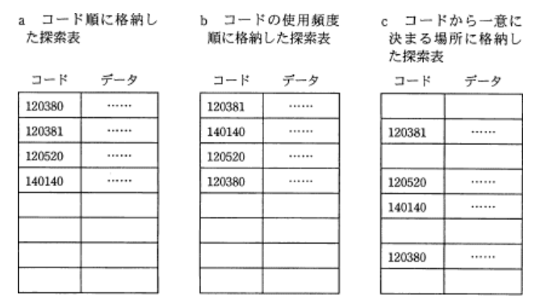

### 平成22年秋期

---
1.後置換記法(逆ポーランド記法)では、式Y=(A-B)\*CをYAB-C\*=と表現する。次の式を逆ポーランド記法で表現したもの\
Y=(A+B)\*(C-(D/E))

- A.**YAB+CDE/-\*=**\
演算子を2つの被演算子の右側に記述する表記法。通常の式を計算するのと同じ順番で、普通の計算式を解くのと同じ要領で変換する。1度変換した部分はひとまとまりの項として扱う\
Y=(A+B)\*(C-(D/E))\
1.括弧内を変換する\
-> Y=AB+\*(C-DE/)\
2.もう1つの括弧内も変換する\
-> Y=AB+\*CDE/-\
3.2つの項の積なので\*を移動する\
-> YAB+CDE/-\*=

---
3.探索表の構成法を例とともに下記に示す。探索の平均計算量が最も小さい探索手法の組み合わせはどれか。探索表のコードの空欄は表の空きを示す

- A.**a : 2分探索, b : 線形探索, c : ハッシュ表探索**\
a : コード順に整列済みなので、線形探索または2分探索を使用可能。線形探索は (N+1)/2回、2分探索は $log_2N$ 回のため要素数が同じであれば平均探索回数は2分探索の方が少なく済む\
b : 使用頻度が高いデータほど探索表の先頭に位置している。線形探索では探索表の先頭から順に探索するので、効率的に探索できる\
c : 探索データのキー値から、データの格納場所を直接計算する方法で、基本的には1回の計算で一意に目的のデータに辿り着ける

---
5.システムの信頼性向上技術に関する記述

- A.**故障が発生した時に対処するのではなく、品質管理などを通じてシステム構成要素の信頼性を高めることをフォールトアボイダンスと呼ぶ**\
システム構成機器に信頼性(稼働率)の高いものを使用することで、故障そのものを排除しようとする設計手法\
フォールトトレラントは、障害時に必要な機能を提供し続けること(耐故障)を目指す設計手法

- 故障が発生した時に、予め指定された安全な状態に保つことをフェールソフトと呼ぶ\
フェールセーフの説明。フェールソフトは、障害発生時に多少の性能低下を許容し、システム全体の運転継続に必要な機能を維持させようとする考え方

- 故障が発生した時に、予め指定されている縮小した範囲のサービスを提供することをフォールトマスキングと呼ぶ\
フェールソフトの説明。フォールとマスキングは、障害時にその障害を内部に留め、外部向けの機能やサービスに影響を与えないように制御する考え方

- 故障が発生した時に、その影響が誤りとなって外部に出ないように訂正することをフェールセーフと呼ぶ\
フォールトマスキングの説明。フェールセーフは、システムに不具合や故障があった時でも、障害の影響範囲を最小限に留め、常に安全を最優先して制御を行う考え方
